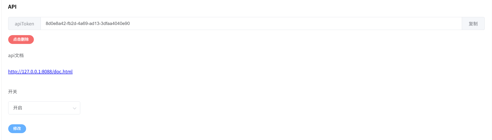
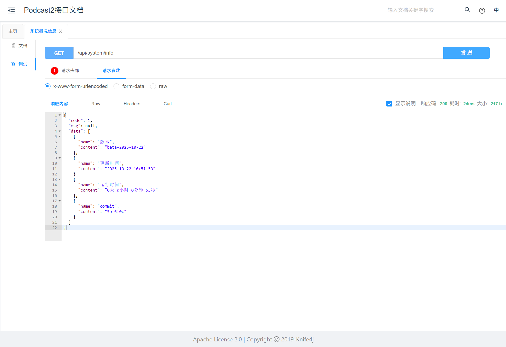
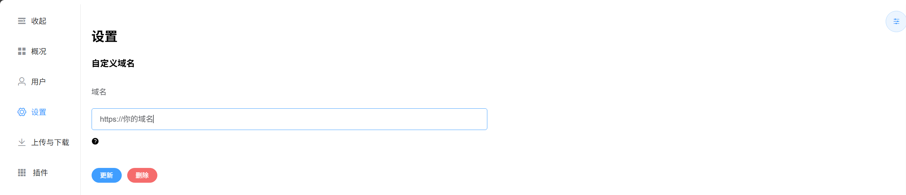
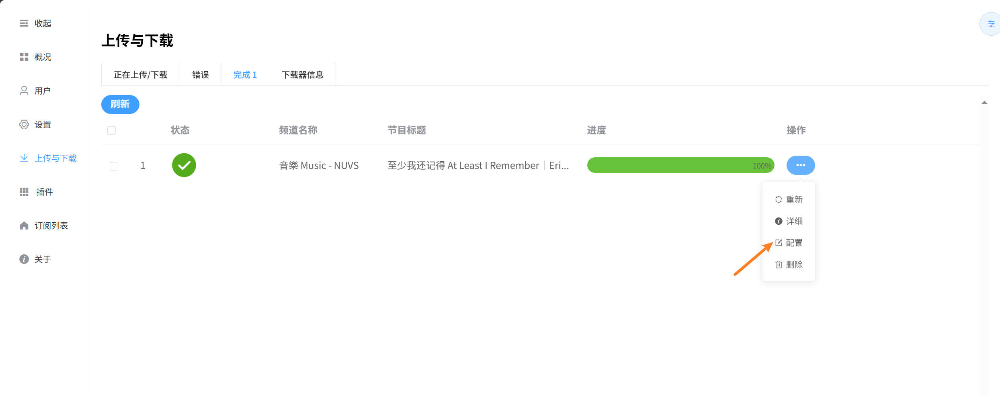
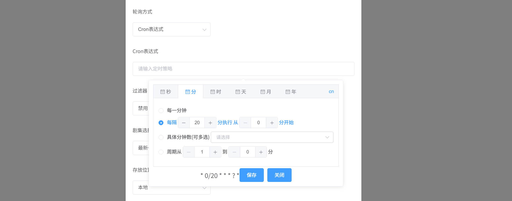
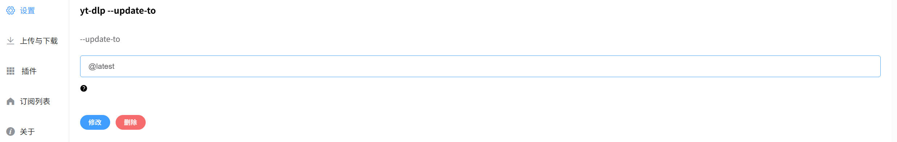
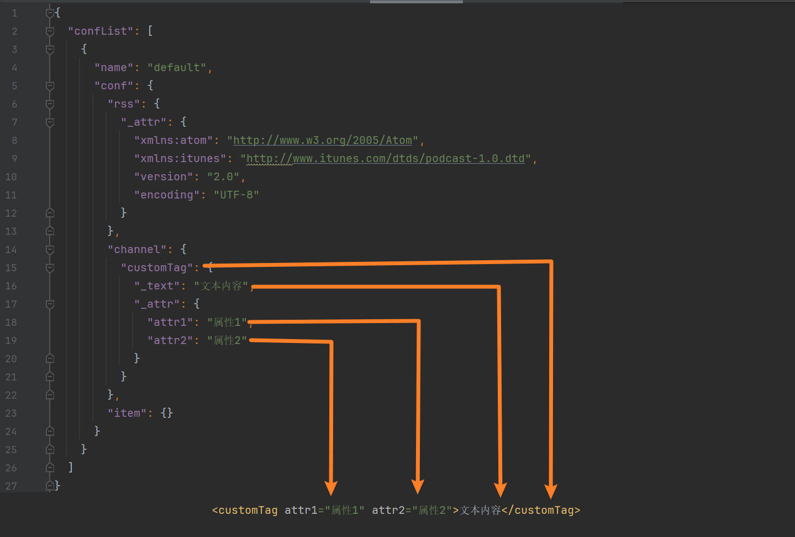

# 高级应用
如果想更进一步，可以看看这里。
## API 接口调用
使用api接口来控制podcast2，需要podcast2版本2.5.0+
> 调用 API 接口需要掌握以下前置知识：
>
> 1. **API 概念**：了解 API 的基本概念。
> 2. **HTTP 协议**：熟悉常用的 HTTP 请求方法（GET、POST 等）和状态码。
> 3. **数据格式**：理解 JSON 和 XML，常用于请求和响应。
> 4. **API 文档**：能够阅读并理解 API 文档，知道请求参数和返回格式。
> 5. **Swagger**：测试和调试 API 调用。

### 开启API文档
所有 API 调用都需在header中加入apiToken

### 请求示例



## 添加订阅
> 如果默认配置无法满足，可以看看下面。
### 同步方式
为了应对博主在短时间内更新多期节目的情况，我们提供了 **同步方式** 选项，允许用户根据自己的需求选择如何同步节目。

- **最新**（默认）：只下载最新发布的一期节目。适合关注单期节目更新的用户。

- **最近**：下载最近一段时间内更新的多期节目，确保不会漏掉博主短时间内更新的内容。适合那些希望及时获取所有新内容的用户。

用户可以根据自己的偏好选择适合的同步方式，以确保不会错过任何重要的节目。

### 追加节目

<p>除了通过频道订阅获取博主的最新内容外，我们还提供了 追加节目 功能。</p>

<p>通过该功能，用户可以在发现有趣的视频时，直接将该视频添加到自己的订阅列表中，而不需要整个频道的订阅。</p>

### 创建空订阅
可以创建一个空白的订阅列表，然后通过 **追加节目** 功能，将自己喜欢的节目逐步加入到订阅中。这样，你可以根据兴趣打造完全个性化的订阅列表。

### 自定义剧集
自定义的是视频列表，如1-5,7会下载列表中序号1到5和7的视频。
**注意** 需要在英文状态下输入

### 最近30集
最多下载最近30集节目，但不一定有30集。

## Caddy 开启 HTTPS
> 需要掌握Caddy的基本用法
>
### Caddyfile
```text
  你的域名 {
	reverse_proxy localhost:8088
} 
```

## Crt和key 开启 HTTPS
### 文件格式要求

```shell
# 证书文件格式必须是crt
# 密钥文件格式必须是key
# 重启后并以https访问
```

## 自定义附件域名
> 开启HTTPS后必要设置
> 


## 上传与下载
### 编辑重新下载配置
> 有些时候下载失败可能是没有可用下载格式，需要重新配置下载。
> 


## Cron表达式
> 订阅默认是按间隔秒数更新的
> 


## yt-dlp 更新至不同分支
> 可以快速更新至修复bug的分支， 默认是`@latest`最新稳定版的。详细请参考：https://github.com/yt-dlp/yt-dlp?tab=readme-ov-file#update
>


## 自定义XML标签
> 可能有些客户端无法解析Podcast2默认的XML标签，这时可以考虑自定义标签试一下，目前该功能还在`实验阶段`。
>
### 结构要求
```json
{
  "confList": [
    {
      "name": "配置名称",
      "conf": {
        "rss": {},
        "channel": {},
        "item": {}
      }
    }
  ]
}
```
### 属性与文本内容
> `_attr` 和`_text` 是分别设置标签属性与文本内容的。
>


### 变量引用
> 引用方式`{字段名}`，支持字段请看：[Channel](https://github.com/yajuhua/podcast2API/blob/master/src/main/java/io/github/yajuhua/podcast2API/Channel.java) 
> 和 [Item](https://github.com/yajuhua/podcast2API/blob/master/src/main/java/io/github/yajuhua/podcast2API/Item.java)
### 示例配置文件
```json
{
  "confList": [
    {
      "name": "default",
      "conf": {
        "rss": {
          "_attr": {
            "xmlns:atom": "http://www.w3.org/2005/Atom",
            "xmlns:itunes": "http://www.itunes.com/dtds/podcast-1.0.dtd",
            "version": "2.0",
            "encoding": "UTF-8"
          }
        },
        "channel": {
          "title": {
            "_text": "<![CDATA[ {title} ]]>"
          },
          "pubDate": {
            "_text": "{latestPubDate}"
          },
          "link": {
            "_text": "<![CDATA[ {link} ]]>"
          },
          "itunes:image": {
            "_attr": {
              "href": "{image}"
            }
          },
          "description": {
            "_text": "<![CDATA[ {description} ]]>"
          },
          "itunes:author": {
            "_text": "<![CDATA[ {title} ]]>"
          },
          "itunes:category": {
            "_attr": {
              "text": "null"
            }
          }
        },
        "item": {
          "title": {
            "_text": "<![CDATA[ {title} ]]>"
          },
          "pubDate": {
            "_text": "{publicTime}"
          },
          "link": {
            "_text": "<![CDATA[ {link} ]]>"
          },
          "enclosure": {
            "_attr": {
              "url": "{enclosure}",
              "type": "{type}"
            }
          },
          "itunes:duration": {
            "_text": "{duration}"
          },
          "itunes:image": {
            "_attr": {
              "href": "{image}"
            }
          },
          "description": {
            "_text": "<![CDATA[ {description} ]]>"
          }
        }
      }
    }
  ]
}
```


### 对应XML
```xml
<?xml version="1.0" encoding="UTF-8"?>
<rss version="2.0" encoding="UTF-8" xmlns:atom="http://www.w3.org/2005/Atom" xmlns:itunes="http://www.itunes.com/dtds/podcast-1.0.dtd">
	<channel>
		<title><![CDATA[ 音樂 Music - NUVS ]]></title>
		<pubDate>Sun, 26 Oct 2025 21:9:32 +0800</pubDate>
        <link><![CDATA[ https://www.ganjingworld.com/zh-CN/channel/1fjrhcmij2n43KxCh1HPGLLjB1c10c?tab=videos ]]></link>
		<itunes:image href="https://image5-us-west.cloudokyo.cloud/image/v1/ad/84/53/ad8453f1-afb2-4482-8925-00832e4060e3/672.webp"/>
		<description><![CDATA[ Music Sharing Channel, Saving and Sharing the Worldwide Music]]></description>
		<itunes:author><![CDATA[ null ]]></itunes:author>
		<itunes:category text="null"/>
	<item>
		<pubDate>Sun, 26 Oct 2025 21:9:32 +0800</pubDate>
		<title><![CDATA[ 至少我还记得 At Least I Remember｜Eric周兴哲  ]]></title>
		<link><![CDATA[ https://www.ganjingworld.com/video/1i1s6h6ncp01spMBiXqoxY8r61nc1c ]]></link>
		<enclosure url="http://127.0.0.1:8088/resources/e85d4983-d023-4562-b30d-8cfff5a7d35f.m4a"  type="audio/m4a"/>
		<itunes:duration>00:05:03</itunes:duration>
		<description><![CDATA[  ]]></description>
		<itunes:image href="https://image5-us-west.cloudokyo.cloud/image/v3/8a/15/6a/8a156acd-1757-49d4-8e7b-876be289e0e2/672.webp"/>
	</item>
	</channel>
</rss>
```


