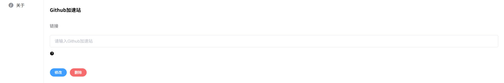
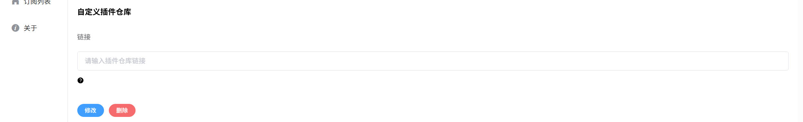

## 兼容性
> v1.x.x 与 v2.x.x 不兼容


## 忘记密码

### 进入数据卷目录

```shell
[root@centos7 ~]# docker volume inspect podcast2
[
    {
        "CreatedAt": "2024-03-23T19:57:47+08:00",
        "Driver": "local",
        "Labels": null,
        "Mountpoint": "/var/lib/docker/volumes/podcast2/_data",
        "Name": "podcast2",
        "Options": null,
        "Scope": "local"
    }
]
[root@centos7 ~]# cd /var/lib/docker/volumes/podcast2/_data
[root@centos7 _data]# ls
cert  config  database  logs  plugin  resources  tmp
[root@centos7 _data]# cd config/
```

### 修改config.json

```shell
#initUserNameAndPassword改成true
{"initUserNameAndPassword":true,"initPath":false}
```

### 重启后将恢复默认用户名和密码

> 用户名: admin  
> 密码: 123456

<br>

## 忘记访问路径
### 修改config.json

```shell
#initPath改成true
{"initUserNameAndPassword":false,"initPath":true}
```
### 重启后将恢复默认路径

## 更新podcast2

> 数据保留

```shell
# 停止容器
docker stop podcast2

# 删除容器
docker rm podcast2

# 删除本地镜像
docker rmi yajuhua/podcast2:latest

# 拉取最新镜像
docker pull yajuhua/podcast2:latest

# 创建新的容器
docker run -id --name=podcast2 \
-p 8088:8088 \
--restart=always \
--mount source=podcast2,destination=/data \
yajuhua/podcast2:latest
```

## 重新开始

> 如果使用最新版都无法解决，可以试试删除数据

```shell
# 停止容器
docker stop podcast2

# 删除容器
docker rm podcast2

# 删除本地镜像
docker rmi yajuhua/podcast2:latest

# 删除数据
docker volume rm podcast2

# 拉取最新镜像
docker pull yajuhua/podcast2:latest

# 创建新的数据卷
docker volume create podcast2

# 创建新的容器
docker run -id --name=podcast2 \
-p 8088:8088 \
--restart=always \
--mount source=podcast2,destination=/data \
yajuhua/podcast2:latest
```

## 项目在线更新
podcast2 v2.4.0开始支持在线更新，国内需要设置代理，也可以直接Github加速站。

下载完成后重启即为新版本

## 插件列表无法加载
插件列表的json数据是由cloudflare pages提供，可能存在无法访问的情况，下面有两个解决方法

### 1.更换插件仓库Url
[https://plugin.lancarjaya.eu.org/metadata.json](https://plugin.lancarjaya.eu.org/metadata.json)


### 2.上传本地插件
[下载插件](https://github.com/yajuhua/generate-plugin-metadata-action/tree/master/v2)<br>
上传插件


## 插件bug或失效
由于插件并非使用官方接口，存在不稳定性。若发现插件失效，请提交[issues](https://github.com/yajuhua/podcast2/issues/new?assignees=&labels=bug&projects=&template=bug-report.yaml)

## 网络

### 插件代理设置
如果需要在容器内直接使用宿主机的网络，可以在创建容器时添加 `--network=host` 参数启用主机网络模式，使容器与宿主机处于同一个网络环境，从而共享网络资源。

### 端口冲突
服务默认使用 **8088 端口**，如果宿主机的 8088 端口已被占用且容器使用主机网络模式（host 模式），服务将因端口冲突而启动失败。解决方法是在创建容器时通过设置环境变量修改端口，例如 `-e SERVER_PORT=8089`，使服务改为从 8089 端口启动，从而避免冲突。

---
